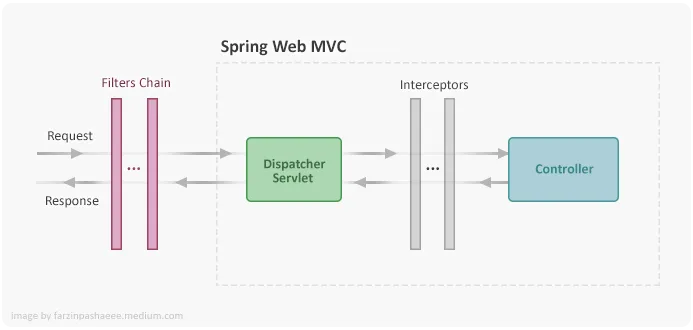

# Spring Boot Web Filter
A Filter in the Spring Boot application is a solution used to intercept the HTTP requests and responses of your application. Filter helps us to perform two operations Before sending the request to the Dispatcher and Before sending a response to the client.
Filters can be used for different well-known use cases like Logging, Authentication and Security, Transaction and request manipulation.

# api-audit-service 
This project is a demo example to illustrate logging request to a persistence data store (MongoDB)
to audit the incoming request . 

